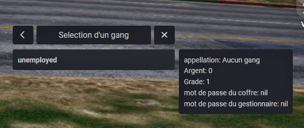
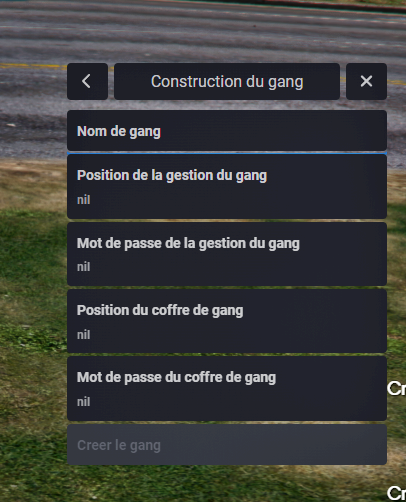

# e_gangcreator

## dependencies

- [ox_lib](https://github.com/overextended/ox_lib/releases)
- [ox_inventory](https://github.com/overextended/ox_inventory/releases)

## install

- add file in your ressource
- add in your cfg `add_ace group.admin gangcreator allow # allow commands gangcreator` and `ensure e_gangcreator`

## information

You can edit all file in ressource

## pictures

